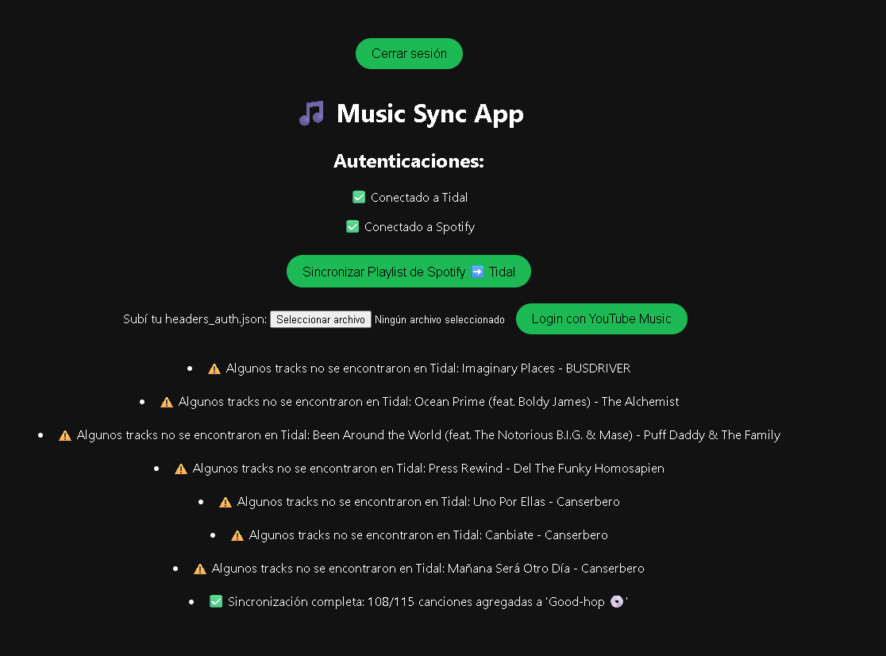

# Music Sync App

Easily synchronize your Spotify playlists to Tidal using this web application built with Flask.

## Features

- Authentication with Spotify and Tidal.
- Select Spotify playlists to sync with Tidal.
- Automatic song synchronization between platforms.
- Upload credentials for YouTube Music (experimental).

## Project Structure

```
.
├── auth/                  # Authentication modules (Spotify, Tidal, YouTube)
├── static/                # Static files (CSS)
├── templates/             # HTML templates (Jinja2)
├── yt_headers/            # Credential files for YouTube Music
├── debug_app.py           # Main Flask app
├── sync.py                # Spotify ↔ Tidal sync logic
├── .env                   # Environment variables (do not share)
├── requierements.txt      # Project dependencies
```

## Installation

1. **Clone the repository**  
   ```sh
   git clone https://github.com/your_user/music-sync.git
   cd music-sync
   ```

2. **Install dependencies**  
   ```sh
   pip install -r requierements.txt
   ```

3. **Set up environment variables**  
   Copy the `.env` file and fill in your Spotify, Tidal, and YouTube Music credentials.

4. **Run the application**  
   ```sh
   python app.py
   ```
   The app will be available at [http://localhost:5000](http://localhost:5000).

## Usage

1. Go to the app and log in with Spotify and Tidal.
2. Select the Spotify playlist you want to sync.
3. Click "Sync" to copy the songs to Tidal.
4. (Optional) Upload your YouTube Music credentials for future features.



## Credits

- [Flask](https://flask.palletsprojects.com/)
- [Spotipy](https://spotipy.readthedocs.io/)
- [tidalapi](https://github.com/tamland/python-tidal)
- [ytmusicapi](https://ytmusicapi.readthedocs.io/)

---

**Contributions and suggestions are welcome!